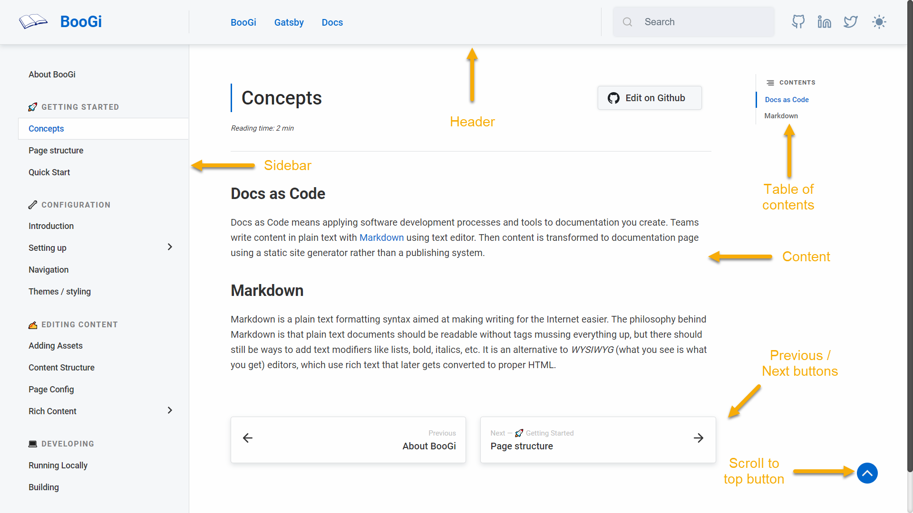
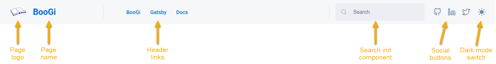
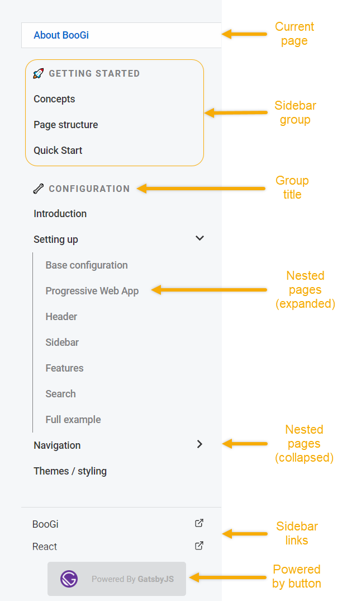

Check BooGi page layout and how different components relate to each other 
and where they are placed.

### General page structure



---

### Header



---

### Navigation sidebar



---

### Page content


---

### Search sidebar


---

### Roundabout Structure

```bash
+-- .boogi.yml   # BooGi CLI configuration file
+-- package.json # 
+-- README.md    # Your BooGi app readme
│
+-- assets/      # Directory with static assets not used inside content (e.g. logo)
│
+-- config/      # Directory with BooGi app configuration
│   +-- config.yml  # BooGi configuration file
│   +-- jargon.yml  # Jargon (abbrevations / definitions) configuration file
│   +-- theme/      # Directory with BooGi app theme (look-and-feel) configuration
│       +-- colors.js # Base colors configuration file
│       +-- dark.js   # Dark theme configuration file
│       +-- light.js  # Light theme configuration file
│
+-- content/     # Directory with your app content
│   +-- index.md # Root page content file (do not remove!)
│
+-- snippets/ # Directory with external code snippets, which can be embedded in content
```